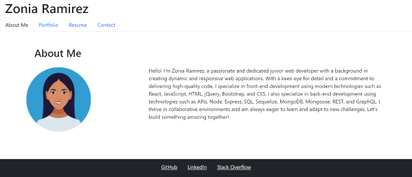
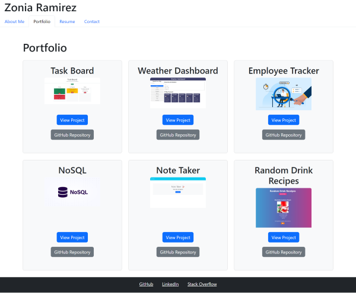
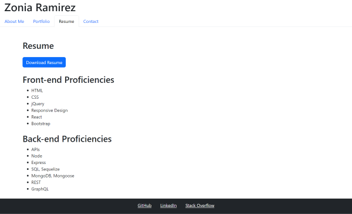
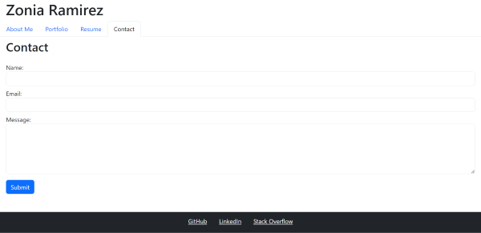

# React Portfolio

This project provides a minimal setup to get React working with Vite, featuring Hot Module Replacement (HMR) and some ESLint rules for code quality.

## Table of Contents

- [Introduction](#introduction)
- [Features](#features)
- [Installation](#installation)
- [Usage](#usage)
- [Screenshots](#screenshots)
- [Links](#links)

## Introduction

This template is designed to help developers quickly set up a React project using Vite. Vite is a fast build tool that leverages native ES modules and provides a lightning-fast development experience.

## Features

- **Fast Refresh**: Instant feedback during development.
- **ESLint**: Pre-configured with some basic rules to maintain code quality.
- **Minimal Setup**: Get started with React and Vite with minimal configuration.

## Installation

```bash
npm install
```

## Usage

To start the development server, run:

```bash
npm run dev
```

or

```bash
npm start
```

## Screenshots









## Links

[Live URL](https://sensational-twilight-2e77eb.netlify.app/)

[GitHub Repo](https://github.com/zoniaramirez/react-portfolio)

## Additional Resources

This template provides a minimal setup to get React working in Vite with HMR and some ESLint rules.

Currently, two official plugins are available:

- [@vitejs/plugin-react](https://github.com/vitejs/vite-plugin-react/blob/main/packages/plugin-react/README.md) uses [Babel](https://babeljs.io/) for Fast Refresh
- [@vitejs/plugin-react-swc](https://github.com/vitejs/vite-plugin-react-swc) uses [SWC](https://swc.rs/) for Fast Refresh
